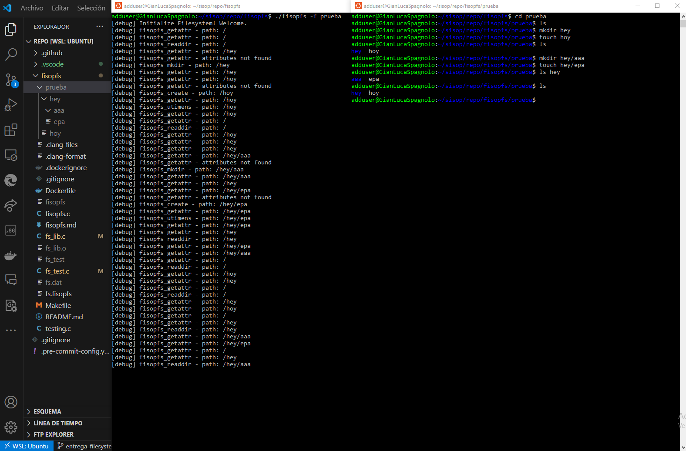
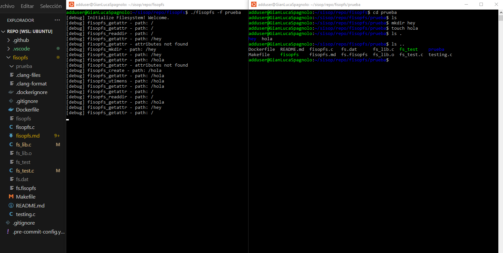
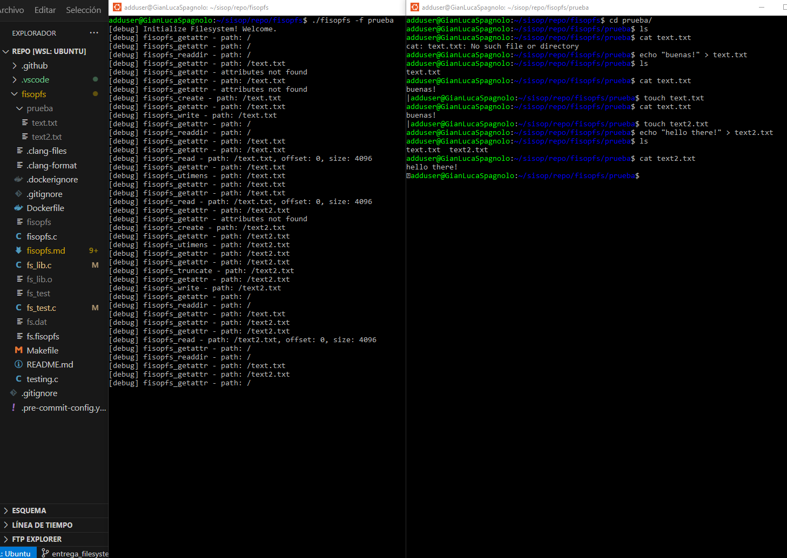
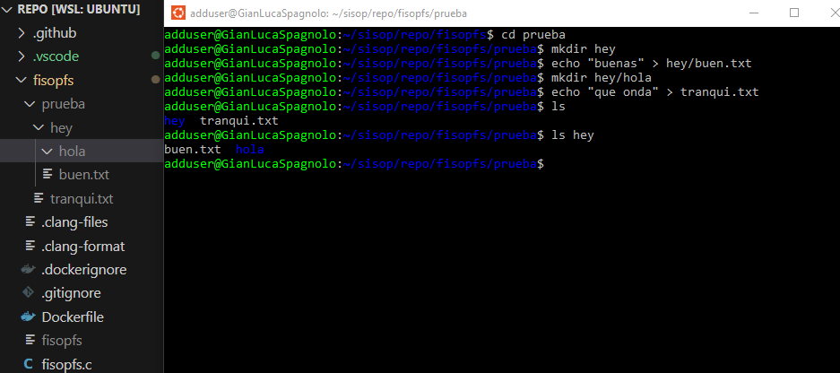
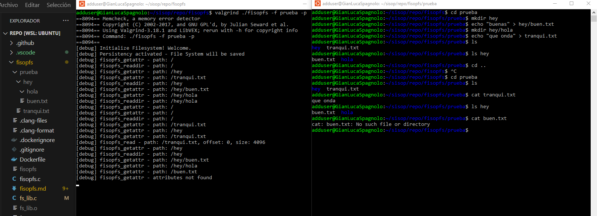

# fisop-fs

## Metodos para usar nuestro File System

Nuestro file system se puede ejecutar con el comando: `./fisopfs -f <nombre_dir>`
Habiendo creado previamente una carpeta con <nombre_dir> la cual sera usada para montar el file system.

Se dispone del flag **-p** para activar la persistencia de los datos del file system, una vez terminada su ejecucion. De modo que, la proxima vez que se ejecute el file system (sea o no usando dicho flag) se persistiran los datos que fueron guardados previamente.

Tambien se dispone de una numerosa cantidad de tests a ejecutar con el comando `make test` el cual verificara una gran cantidad de funcionalidades implementadas en el file system. Ademas, se disponen de las siguientes imagenes para verificar el funcionamiento de aquellas operaciones que no han podido ser testeadas, pero que se asegura de modo que funcionen correctamente.

---

## Elecciones del diseño adoptadas para desarrollar el sistema de archivos

### Estructuras en memoria y estructuras auxiliares utilizadas

El sistema de archivos que implementamos está compuesto por un arreglo de directorios y otro de archivos, con sus respectivos tamaños. Para modelar lo expuesto, implementamos dos estructuras auxiliares para almacenar los archivos y los directorios, junto a sus metadatos:

* **fs_d_entry**: representa a los directorios, donde se almacena el nombre, un puntero al directorio padre, y diversos campos para los metadatos.
* **fs_file**: representa a los archivos, donde se incluye el nombre, un puntero al directorio donde se encuentra, y el contenido dentro de este. A su vez, se almacenan los metadatos.

### Búsqueda de un archivo dado un path

Para lograr encontrar un archivo específico dado un path, creamos una función en fs_lib.c llamada get_file(fs_t *fs, const char *file_name, fs_d_entry_t *dir), donde buscamos secuencialmente el nombre del archivo dentro de nuestro filesystem. Una vez hallado, verificamos si el archivo pertenece al directorio que se especifica, comparando el path dado con el campo de nuestra estructura archivo que contiene un puntero a su directorio correspondiente. En el caso que se encuentre un archivo que coincide tanto en nombre como en directorio, retornamos un puntero a ese archivo. En caso contrario, se retorna null.

### Formato de Serialización en disco

La serialización y la deserialización fueron implementadas en fs_lib.c, haciendo uso de las funciones fwrite y fread respectivamente.
Por un lado, en cuanto a la **serialización**, creamos una función llamada fs_destroy(const char *path, fs_t *fs, int persist) que se encarga de:

1. **Abrir un archivo**: mediante un path especificado en modo escritura (si no es posible, se libera la memoria asignada, se cierra el archivo, y se termina la función)
2. **Verificar si los datos se desean persistir**: si persist es 0, no se persisten los datos.
3. **Escribir los datos en el archivo**: utilizando la función fwrite() se escribe en el archivo
    * el tamaño del directorio
    * los datos del directorio
    * el tamaño de los archivos
    * los datos de los archivos
4. **Cerrar el archivo y liberar la memoria**

Por otro lado, en cuanto a la **deserialización**, elaboramos una función llamada fs_init(const char *path) a cargo de:

1. **Abrir el archivo**: mediante un path especificado en modo lectura (si está vacío, se crea y se retorna una nueva estructura)
2. **Leer datos del Archivo**: a través de la función fread(), se leen
    * el tamaño del directorio
    * los datos del directorio
    * el tamaño del archivo
    * los datos de los archivos
3. **Cerrar el archivo y retornar el filesystem**: se devuelve la estructura fs_t con los datos leídos del archivo.

### Visualizacion de la Serializacion

En estas dos imagenes se puede visualizar como, en primera instancia, se inicia el file system y se crean numerosos directorios y archivos, los cuales se pueden identificar en la carpeta `prueba` usada para montar el file system. Mientras que, en la segunda imagen, se puede identificar como despues de haber desmontado el file system, al iniciarlo denuevo se mantienen aquellos elementos que se habian creado. Todo esto es posible gracias al flag **-p** que se indica al momento de montar el file system por primera vez, en el comando `valgrind ./fisopfs -f prueba -p`.
